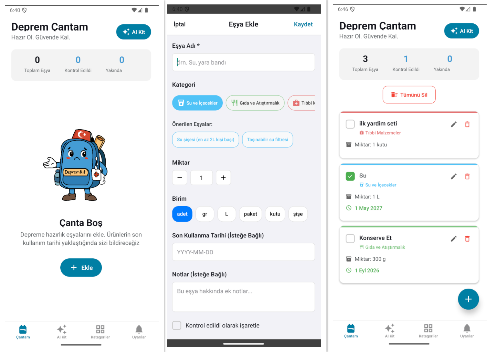

<div align="center">
  
</div>

# Earthquake Kit - Emergency Bag Application 🎒

This application is a React Native app that helps you organize your emergency preparedness bag for earthquakes and other emergencies

<div align="center">
   
</div>

## Features

- ✅ Organize emergency items by categories
- 📅 Track expiration dates
- 🔔 Notifications for items that are expiring/expired
- 📊 Bag status statistics
- 🌙 Dark/light theme support

## Run the app 

1. Install dependencies

   ```bash
   npm install
   ```

2. Start the application

   ```bash
   npx expo start
   ```

In the output, you'll find options to open the app:

- [Development build](https://docs.expo.dev/develop/development-builds/introduction/)
- [Android emulator](https://docs.expo.dev/workflow/android-studio-emulator/)
- [iOS simulator](https://docs.expo.dev/workflow/ios-simulator/)
- [Expo Go](https://expo.dev/go), a limited sandbox for trying out app development with Expo

You can start developing by editing the files in the **app** directory. This project uses [file-based routing](https://docs.expo.dev/router/introduction).

